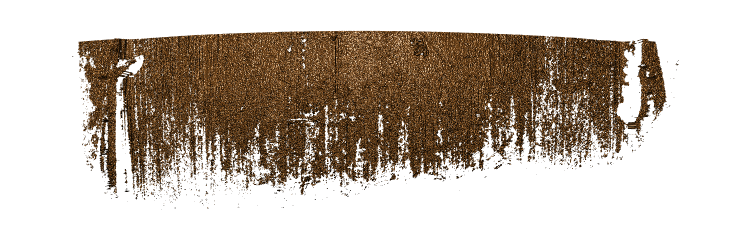

<!-- README.md is generated from README.Rmd. Please edit that file -->

```{r, include = FALSE}
knitr::opts_chunk$set(
  collapse = TRUE,
  comment = "#>",
  fig.path = "man/figures/README-",
  out.width = "100%"
)
```

# DS401

<!-- badges: start -->
<!-- badges: end -->

The goal of the DS401 R package is to assess quality of 3d topographics scans in form of x3p images. 

## Installation

You can install the development version of DS401 from [GitHub](https://github.com/) with:

``` r
# install.packages("devtools")
devtools::install_github("heike/DS401")
```

## Example

This is a basic example which shows you how to solve a common problem:

```{r example}
library(DS401)
## basic example code
library(x3ptools)
```

### This scan has a lot of problems

```{r}
x3p_image(fau277_bb_l2, file = "man/figures/fau277_bb_l2.png")
```

```{r, echo=FALSE}

```

The `DS401` package combines a set of functions assessing the quality of scans.

### Feature extracted

`extract_na` calculates the percentage of values that are missing in the surface matrix of the scan. For the scan shown above, this percentage is quite high:

```{r}
extract_na(fau277_bb_l2)
```


What is special about using `README.Rmd` instead of just `README.md`? You can include R chunks like so:

```{r cars}
summary(cars)
```

You'll still need to render `README.Rmd` regularly, to keep `README.md` up-to-date. `devtools::build_readme()` is handy for this. 

You can also embed plots, for example:

```{r pressure, echo = FALSE}
plot(pressure)
```

In that case, don't forget to commit and push the resulting figure files, so they display on GitHub and CRAN.
