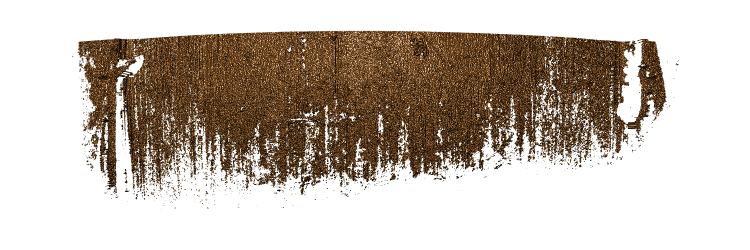
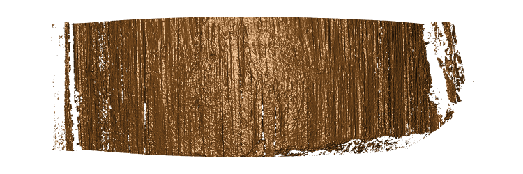

<!-- README.md is generated from README.Rmd. Please edit that file -->

# DS401

<!-- badges: start -->

[](https://github.com/heike/DS401/actions)
<!-- badges: end -->

The goal of the DS401 R package is to assess quality of 3d topographics
scans in form of x3p images.

## Installation

You can install the development version of DS401 from
[GitHub](https://github.com/) with:

``` r
# install.packages("devtools")
devtools::install_github("heike/DS401")
```

## Example

``` r
library(DS401)
## basic example code
library(x3ptools)
```

### This scan has a lot of problems

``` r
x3p_image(fau277_bb_l2, file = "man/figures/fau277_bb_l2.png")
```



### This scan is about as good as we can hope for

``` r
x3p_image(fau001_ba_l1, file = "man/figures/fau001_ba_l1.png")
```



The `DS401` package combines a set of functions assessing the quality of
scans.

### Feature extracted

#### Overall number of missing values

`extract_na` calculates the percentage of values that are missing in the
surface matrix of the scan. For the scans shown above, the percentages
are quite high for the bad scan and low for the good scan

``` r
extract_na(fau277_bb_l2)
#> [1] 38.26887
extract_na(fau001_ba_l1)
#> [1] 13.83538
```

#### col_na Function

The col_na function’s goal is to distinguish between good and bad scans
based on the proportion of columns with large proportions of missing
values. It takes in three parameters, which are an x3p object, a
percentage to be used as the number acceptable percentage of missing
values in a column, and the proportion that bad columns that is the
threshold for a good scan.

``` r
assess_col_na(fau277_bb_l2)
#> [1] 4.716293
assess_col_na(fau001_ba_l1)
#> [1] 0.8625219
```

#### Assess Median NA Proportion

‘assess_median_na_proportion’ calculates the median proportion of NA
values present in the middle of a 3d scan from a specific number of
different y values. Specifically this variable is calculating the amount
of feathering occuring in the 3d scans.

``` r
assess_median_na_proportion(fau277_bb_l2)# This scan seems to have a problem with feathering
#> [1] 0.08906883
assess_median_na_proportion(fau001_ba_l1)# good scan
#> [1] 0.001310616
```

#### Assess Bottom Empty

``` r
assess_bottomempty(fau277_bb_l2)
#> [1] 95.20528
assess_bottomempty(fau001_ba_l1)
#> [1] 22.90831
```

#### Assess Middle NA Proportion

``` r
assess_middle_na_proportion(fau277_bb_l2)
#> [1] 0.316787
assess_middle_na_proportion(fau001_ba_l1)
#> [1] 0.02565556
```

#### Assess Percentile NA Proportion

``` r
assess_percentile_na_proportion(fau277_bb_l2)
#> [1] 0.7013605
assess_percentile_na_proportion(fau001_ba_l1)
#> [1] 0.00244798
```

#### Assess Rotation

``` r
assess_rotation(fau277_bb_l2)
#> [1] 1.720705
assess_rotation(fau001_ba_l1)
#> [1] 1.098612
```

#### Extract Median NA Proportion

``` r
extract_median_na_proportion(fau277_bb_l2)
#> [1] 0.08906883
extract_median_na_proportion(fau001_ba_l1)
#> [1] 0.001310616
```

### Predictions

``` r
predict_quality(list(fau277_bb_l2, fau001_ba_l1), c(1,1))
#> Loading required package: randomForest
#> randomForest 4.7-1
#> Type rfNews() to see new features/changes/bug fixes.
#> # A tibble: 2 × 11
#>   x3p       x3pname quality_pred quality_type assess_percentile_n… assess_col_na
#>   <I<list>>   <dbl>        <dbl> <chr>                       <dbl>         <dbl>
#> 1 <x3p>           1        0.85  good                      0.0891          4.72 
#> 2 <x3p>           1        0.906 good                      0.00131         0.863
#> # … with 5 more variables: extract_na <dbl>, assess_middle_na_proportion <dbl>,
#> #   assess_rotation <dbl>, assess_bottomempty <dbl>, lighting_protocol <fct>
```
